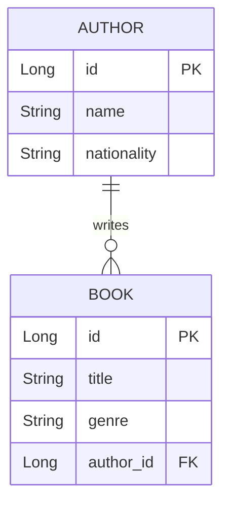
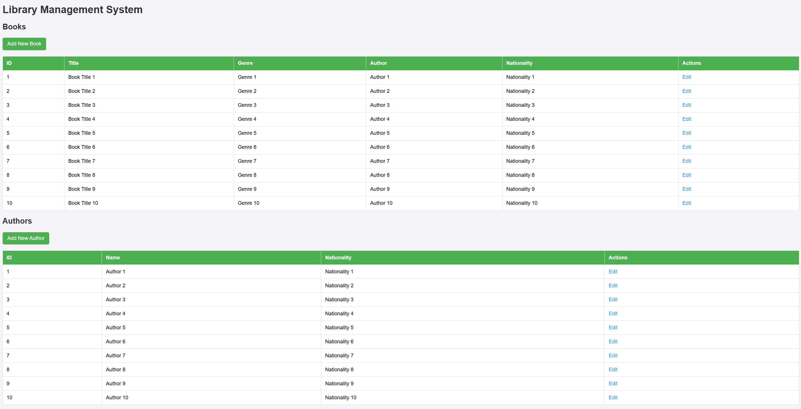
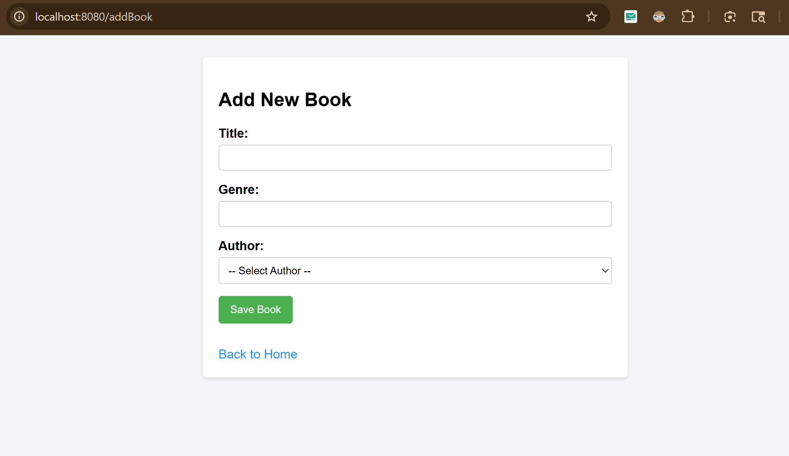
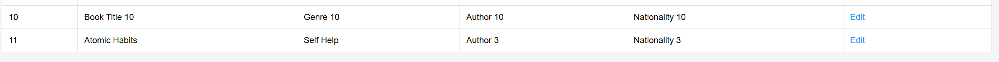
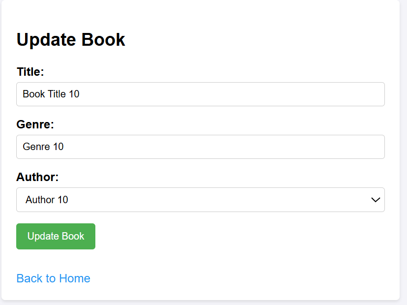
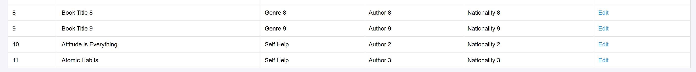

# Library Management System - Database Assignment

## 1. Entity Relationship Design

For this assignment, I chose the entities **Author** and **Book** to demonstrate a One-to-Many relationship.

### Entities:
- **Author**: Represents the creator of a book.
  - Attributes: `id` (Primary Key), `name`, `nationality`.
- **Book**: Represents the book available in the library.
  - Attributes: `id` (Primary Key), `title`, `genre`, `author_id` (Foreign Key).

### Relationship:
An **Author** can have multiple **Books** (One-to-Many), and each **Book** belongs to one **Author** (Many-to-One). This relationship is defined using the JPA `@OneToMany` and `@ManyToOne` annotations.

#### ER Diagram

*(Alternatively, you can view or screenshot the `er_diagram.svg` file generated in the project folder!)*

## 2. Implementation Details

### Populate Database
The database is initialized using Spring Boot's `@PostConstruct` annotation in the `LibraryService.java`. It populates both the `Author` and `Book` tables with 10 sample records each if the database is empty. We are using an in-memory **H2 Database** configured via `application.properties`.

### Create Operation
- **Form**: Two JSP pages (`addAuthor.jsp` and `addBook.jsp`) provide HTML forms using Spring Form tags.
- **Controller**: `LibraryController` handles `POST` requests mapped to `/addAuthor` and `/addBook`. The data submitted via the forms is saved through `LibraryService`.
- **Exception Handling**: Using a `@ExceptionHandler(Exception.class)` method in the controller to handle data integrity violations and display an `error.jsp` view. Additionally, try-catch blocks wrap service calls to display errors inline in the form views if necessary.

### Read Operation
- **View**: The `index.jsp` file iterates over the lists of `books` and `authors` and presents them in an HTML table using JSTL `<c:forEach>` tags. CSS has been used to apply a clean and visually appealing style to these tables.
- **Custom Query**: In `BookRepository.java`, an inner join is explicitly performed using the JPQL query: 
  `@Query("SELECT b FROM Book b JOIN b.author a")`
- **Controller**: Fetches data using the service layer and binds it to the model attributes which are then rendered on the index page.

### Update Operation
- **Form**: The `updateBook.jsp` displays the existing details of a book, fetching the data by ID.
- **Controller**: A GET mapping to `/updateBook/{id}` handles fetching and displaying the prepopulated form. The POST mapping to `/updateBook` handles updating the values via the JPA `save()` method in the service layer, effectively overwriting the existing entity based on its ID.

## 3. Screenshots

*(Placeholder: As this is a text representation, you should run the application and take screenshots of the `index.jsp` page, the `addBook.jsp` page, and the `updateBook.jsp` page to insert them here before exporting to PDF.)*

## 4. Challenges Faced & Solutions

**Challenge 1: JSP Resolution in Spring Boot 3**
- *Issue*: Spring Boot 3 uses Jakarta EE, and traditional JSTL dependencies do not work properly, leading to unresolved JSP tags or 404 errors.
- *Solution*: Replaced `javax.servlet` dependencies with `jakarta.servlet.jsp.jstl-api` and Tomcat embedded jasper to ensure compatibility. Configured the view resolver correctly in `application.properties` with `/WEB-INF/jsp/` as the prefix.

**Challenge 2: Exception Handling for Constraints**
- *Issue*: Adding a book without an author or saving an entity that violates constraints causes the application to crash.
- *Solution*: Implemented global exception handling using `@ExceptionHandler` in the controller, gracefully redirecting users to a user-friendly `error.jsp` page or showing inline error messages.

**Challenge 3: Inner Join in Spring Data JPA**
- *Issue*: Ensuring the fetch strategy accurately retrieves the associated Author when pulling Books.
- *Solution*: Explicitly wrote an inner join using JPQL `@Query` in the repository layer instead of relying solely on default methods.

## 5. Github URL
*(Insert your GitHub repository link here after pushing the code)*
